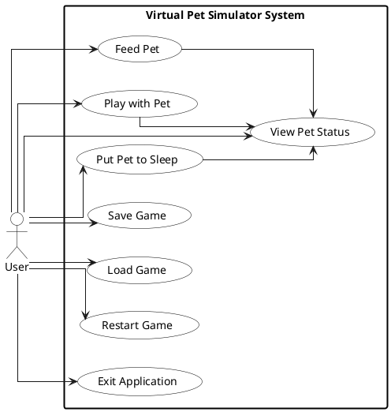
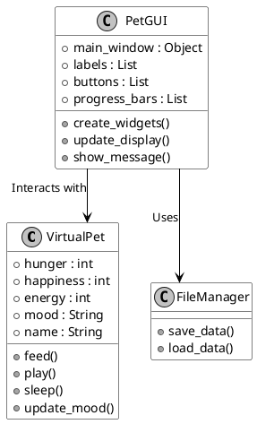
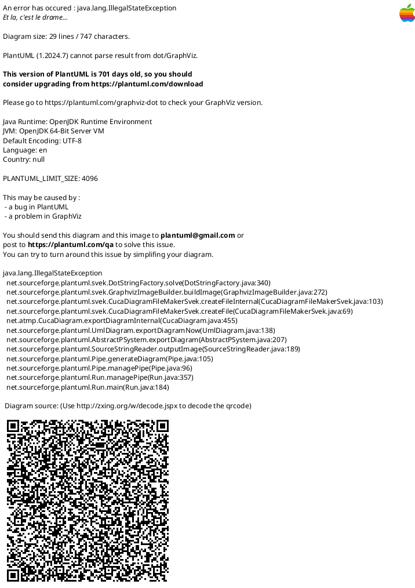
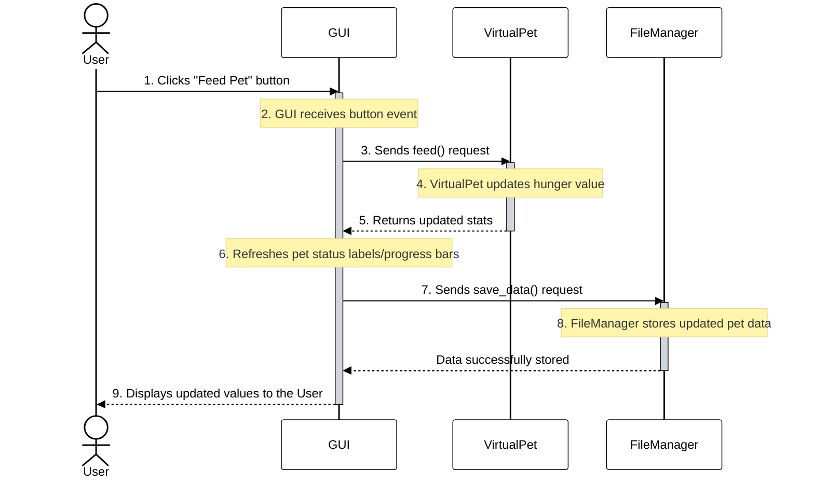
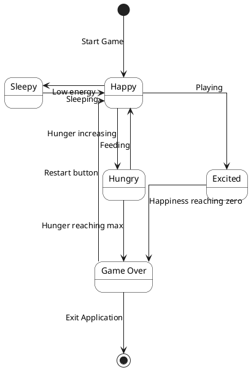

# Virtual Pet Simulator - UML Diagrams

This document contains the professional UML diagrams for the Virtual Pet Simulator application. They are written using [Mermaid.js](https://mermaid.js.org/) syntax, which allows them to render automatically in GitHub, VS Code, and other modern Markdown viewers. 

> **Note on exporting to images:** To export these as high-quality PNG or SVG images, you can paste the code blocks into the [Mermaid Live Editor](https://mermaid.live/), which has a built-in "Export Image" feature.

---

## 1. Use Case Diagram
This diagram shows the system from the User's perspective, mapping out all the actions they can perform.

---

## 2. Class Diagram
This diagram breaks down the system into objects/classes, detailing their attributes, methods, and relationships.

---

## 3. Activity Diagram
This diagram models the dynamic behavior and flow of the program from initialization to exit.

---

## 4. Sequence Diagram
This diagram shows the exact interaction order between the User, GUI, Pet Logic, and File System over time when a button is clicked.

---

## 5. State Diagram
This diagram focuses on the Virtual Pet's states (moods) and how it transitions from one to another based on its stats.

